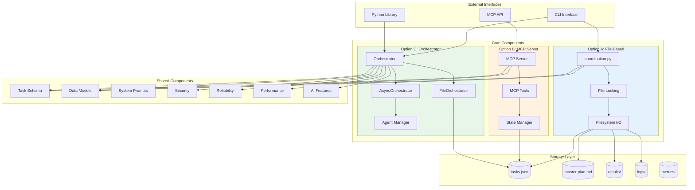
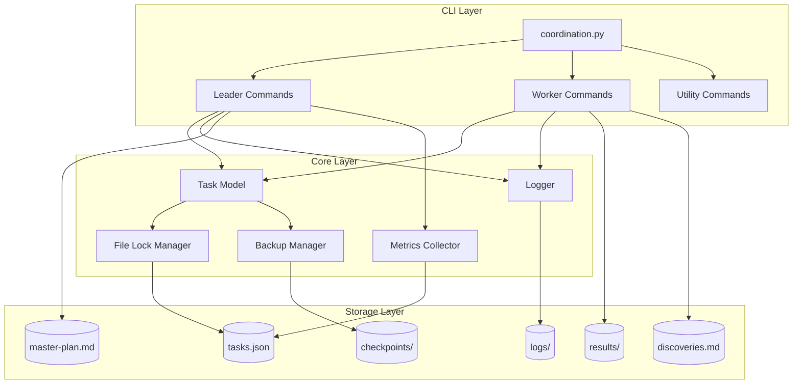
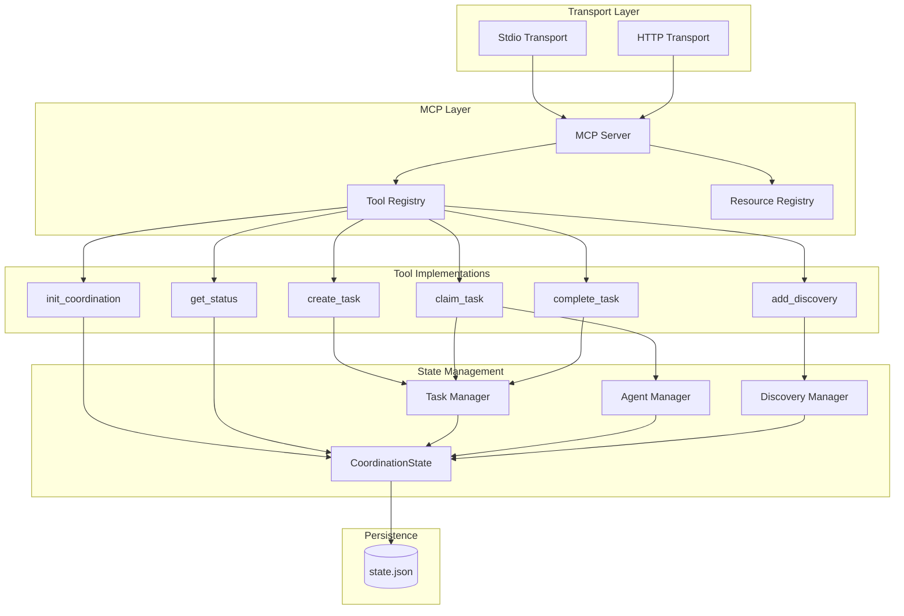
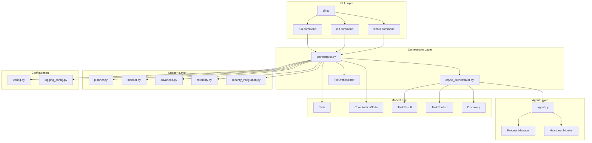
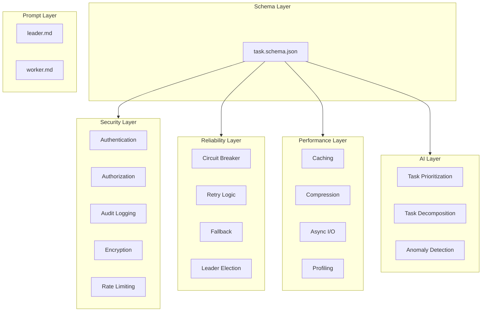
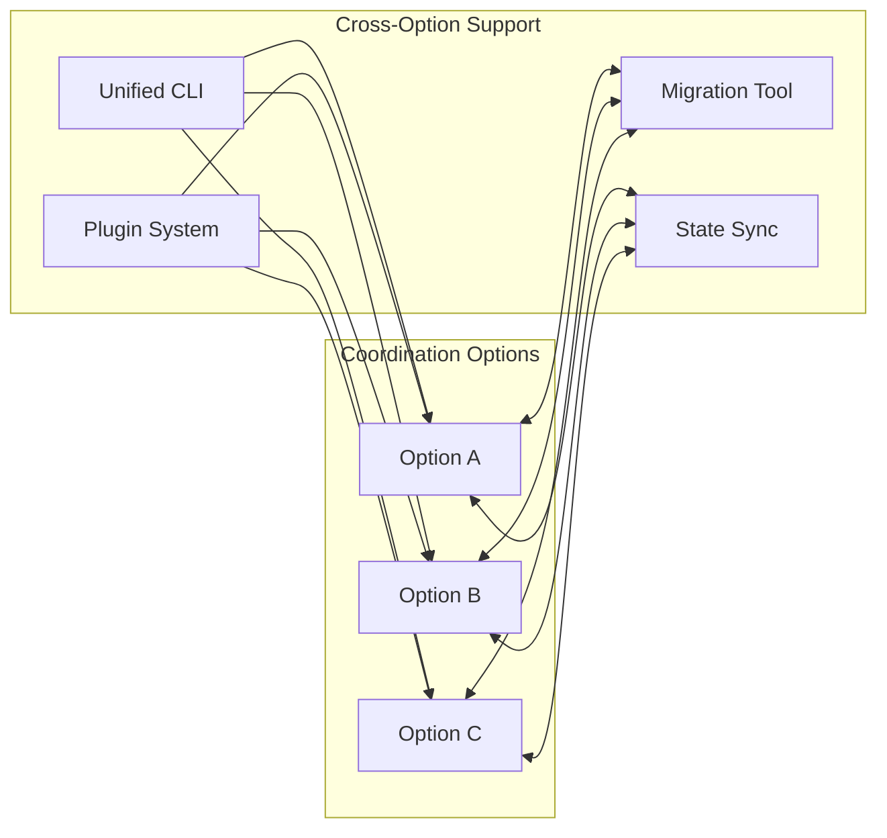
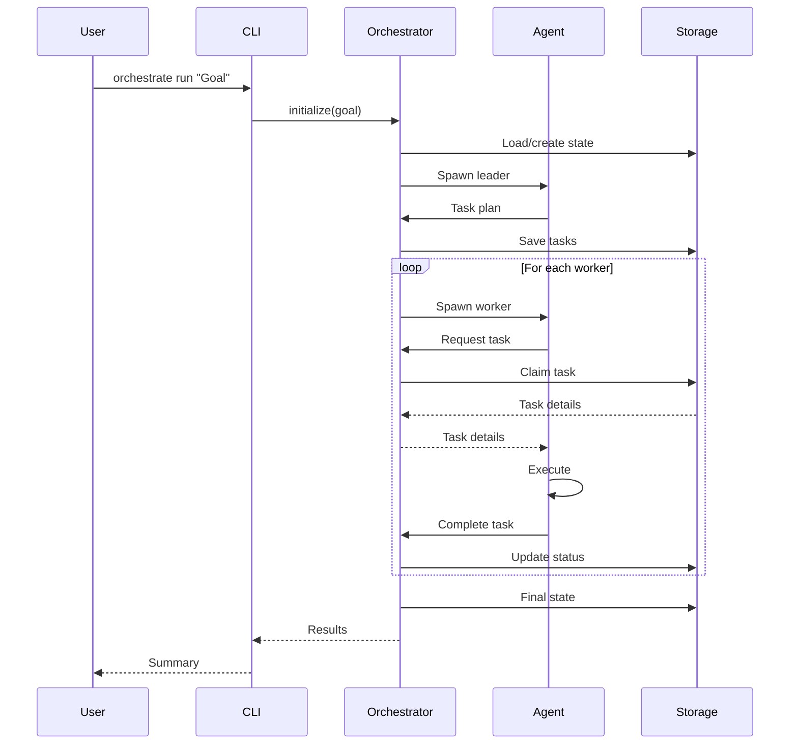

# Component Diagram

This document shows the relationships between components across all three coordination options.

---

## High-Level Component View

---

## Option A: File-Based Components

### Key Components

| Component | File | Responsibility |
|-----------|------|----------------|
| CLI Parser | `coordination.py` | Command-line interface |
| Task Model | `coordination.py` | Task dataclass and operations |
| File Lock | `coordination.py` | `file_lock()` context manager |
| Backup Manager | `coordination.py` | `create_backup()`, `cleanup_old_backups()` |
| Metrics | `coordination.py` | `record_task_created()`, `get_metrics()` |

---

## Option B: MCP Server Components

### Key Components

| Component | File | Responsibility |
|-----------|------|----------------|
| MCP Server | `src/index.ts` | Server setup and transport |
| Tool Registry | `src/index.ts` | Tool definitions |
| State Manager | `src/index.ts` | In-memory state + persistence |
| Tool Handlers | `src/index.ts` | Individual tool implementations |

---

## Option C: Orchestrator Components

### Key Components

| Component | File | Responsibility |
|-----------|------|----------------|
| Orchestrator | `orchestrator.py` | Main coordinator, backend selection |
| AsyncOrchestrator | `async_orchestrator.py` | Async execution, process spawning |
| FileOrchestrator | (internal) | File-based state management |
| Agent | `agent.py` | Claude Code subprocess management |
| Planner | `planner.py` | Task planning and decomposition |
| Monitor | `monitor.py` | Progress tracking and metrics |
| Models | `models.py` | Task, State, Result dataclasses |
| Config | `config.py` | Configuration management |

---

## Shared Components

### Shared Component Locations

| Component | Directory | Purpose |
|-----------|-----------|---------|
| Task Schema | `shared/schemas/` | Canonical task JSON structure |
| System Prompts | `shared/prompts/` | Leader and worker prompts |
| Security | `shared/security/` | Auth, encryption, audit |
| Reliability | `shared/reliability/` | Circuit breaker, retry, fallback |
| Performance | `shared/performance/` | Caching, async I/O |
| AI Features | `shared/ai/` | Prioritization, decomposition |

---

## Cross-Option Integration

### Cross-Option Tools

| Tool | Location | Purpose |
|------|----------|---------|
| Migration | `shared/cross_option/` | Migrate state between options |
| State Sync | `shared/cross_option/` | Synchronize state across options |
| Unified CLI | `shared/cross_option/` | Single CLI for all options |
| Plugin System | `shared/cross_option/` | Extensibility framework |

---

## Data Flow Between Components

---

## See Also

- [System Overview](overview.md)
- [Task Lifecycle](task-lifecycle.md)
- [ADR Index](../adr/README.md)
