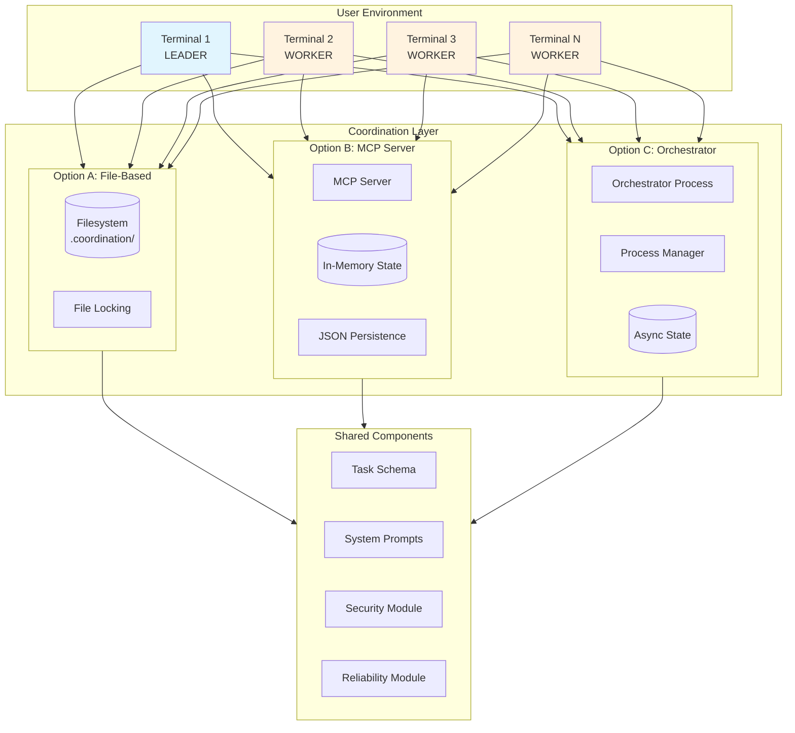
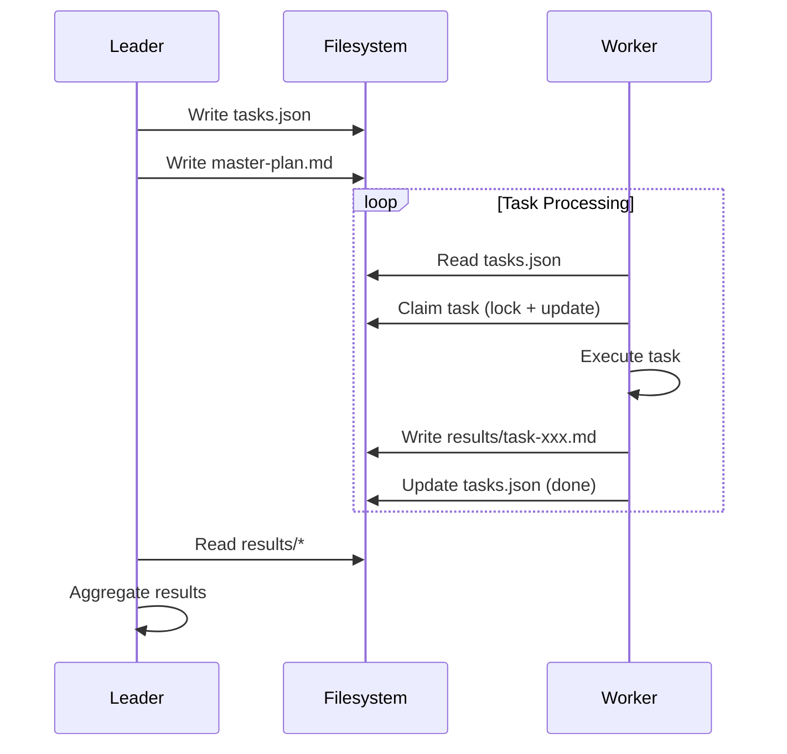
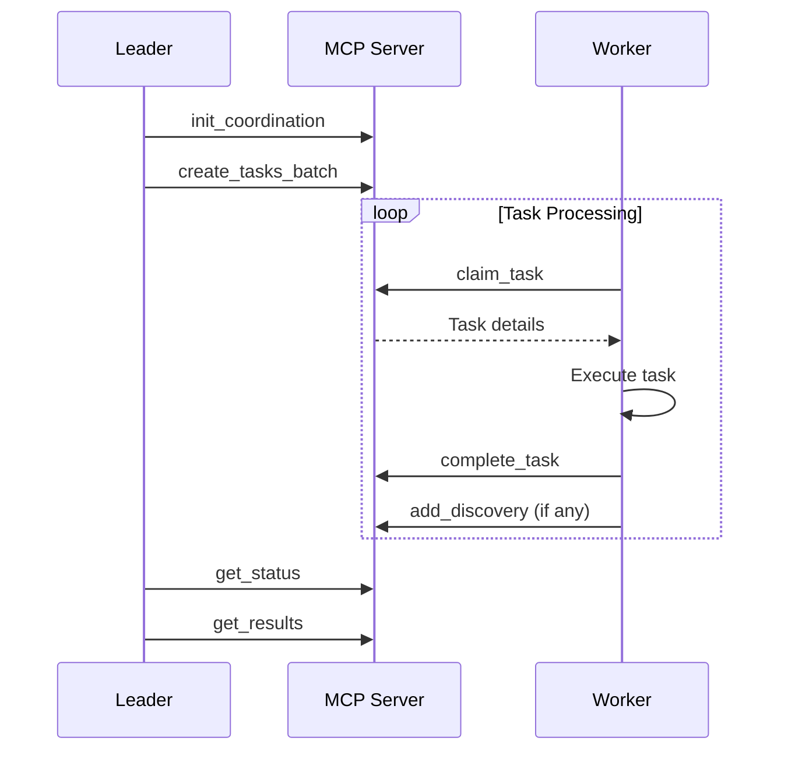
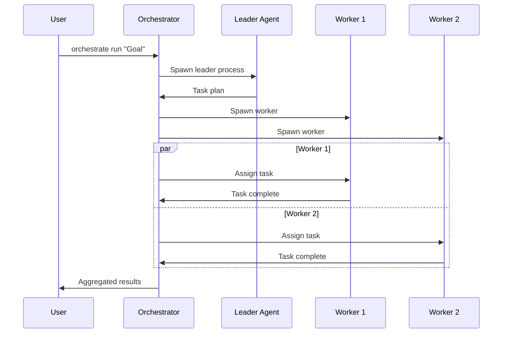
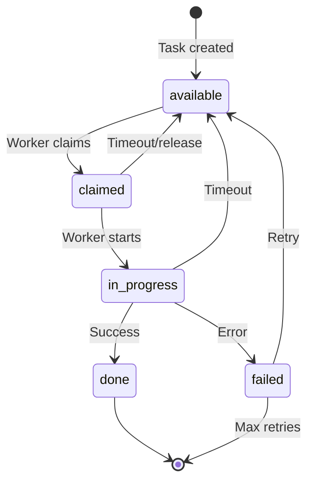
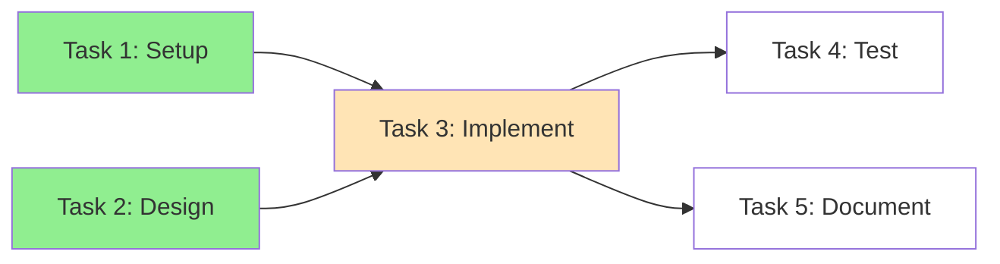
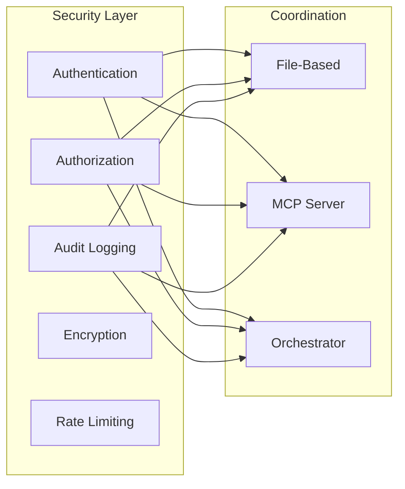
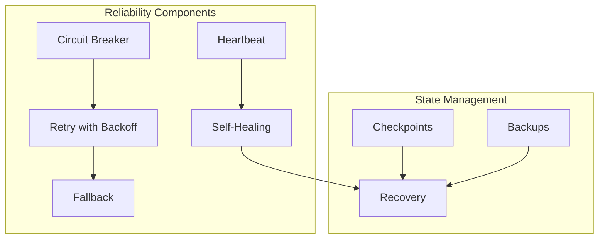

# System Architecture Overview

This document provides a high-level overview of the Claude Multi-Agent Coordination System architecture.

---

## System Overview Diagram



---

## Core Architecture Principles

### 1. Leader-Worker Pattern

The system implements a leader-worker pattern where:

- **One Leader** (Terminal 1): Plans work, creates tasks, monitors progress, aggregates results
- **Multiple Workers** (Terminals 2+): Claim tasks, execute them, report results back

This pattern enables:
- Clear separation of concerns
- Parallel task execution
- Centralized coordination
- Scalable worker pool

### 2. Shared Filesystem as Communication Layer

All coordination options leverage the filesystem as the common ground:

```
.coordination/
├── master-plan.md          # Goal and approach
├── tasks.json              # Task queue (source of truth)
├── context/
│   └── discoveries.md      # Shared findings
├── logs/                   # Per-agent logs
│   ├── leader.log
│   ├── terminal-2.log
│   └── terminal-3.log
└── results/                # Task outputs
    ├── task-001.md
    └── task-002.md
```

### 3. Task-Centric Design

Tasks are the fundamental unit of work:

```json
{
  "id": "task-20240115-a1b2",
  "description": "Implement user login endpoint",
  "status": "available",
  "priority": 1,
  "dependencies": ["task-001"],
  "context": {
    "files": ["src/auth/login.ts"],
    "hints": "Use JWT for tokens"
  }
}
```

### 4. Option Flexibility

Three coordination options serve different needs:

| Aspect | Option A | Option B | Option C |
|--------|----------|----------|----------|
| Communication | File polling | MCP protocol | Process IPC |
| Latency | 1-2 seconds | Real-time | Real-time |
| Setup | None | MCP config | pip install |
| Control | Manual | Semi-auto | Full auto |
| Best for | Prototypes | Production | Automation |

---

## Component Interaction

### Option A: File-Based Flow



### Option B: MCP Server Flow



### Option C: Orchestrator Flow



---

## Data Flow

### Task State Machine



### Dependency Resolution

Tasks with dependencies are only claimable when all dependencies are satisfied:



Legend:
- Green: Completed
- Orange: In Progress
- White: Blocked (dependencies not met)

---

## Security Architecture



See [Security Guide](../guides/security.md) for detailed security practices.

---

## Reliability Architecture



See [ADR-007](../adr/ADR-007-race-condition-handling.md) for race condition handling details.

---

## Scaling Considerations

### Horizontal Scaling

- **Workers**: Add more terminal instances
- **Option B**: Single MCP server handles multiple workers
- **Option C**: Orchestrator spawns/manages workers automatically

### Vertical Scaling

- **Task Complexity**: Adjust timeouts for complex tasks
- **Queue Depth**: Monitor queue size metrics
- **Memory**: Option B/C keep state in memory

### Performance Tips

1. Keep tasks atomic (5-15 min each)
2. Minimize dependencies to enable parallelism
3. Use Option B/C for high-throughput scenarios
4. Monitor metrics for bottlenecks

See [Performance Tuning Guide](../guides/performance-tuning.md) for optimization strategies.

---

## Next Steps

- [Task Lifecycle](task-lifecycle.md) - Detailed task state documentation
- [Component Diagram](components.md) - Component relationships
- [ADRs](../adr/README.md) - Architecture Decision Records
