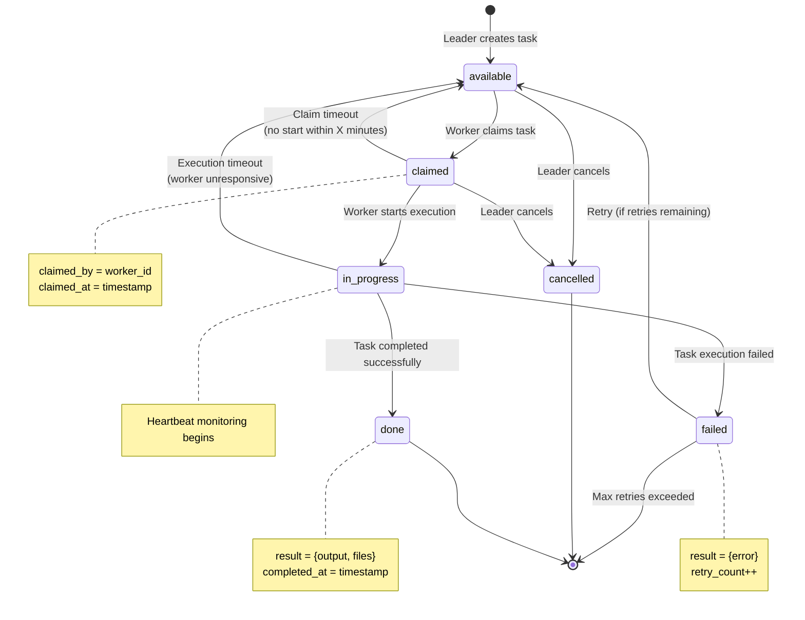
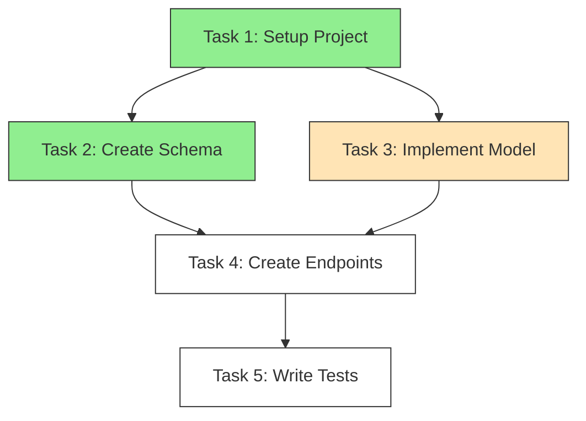
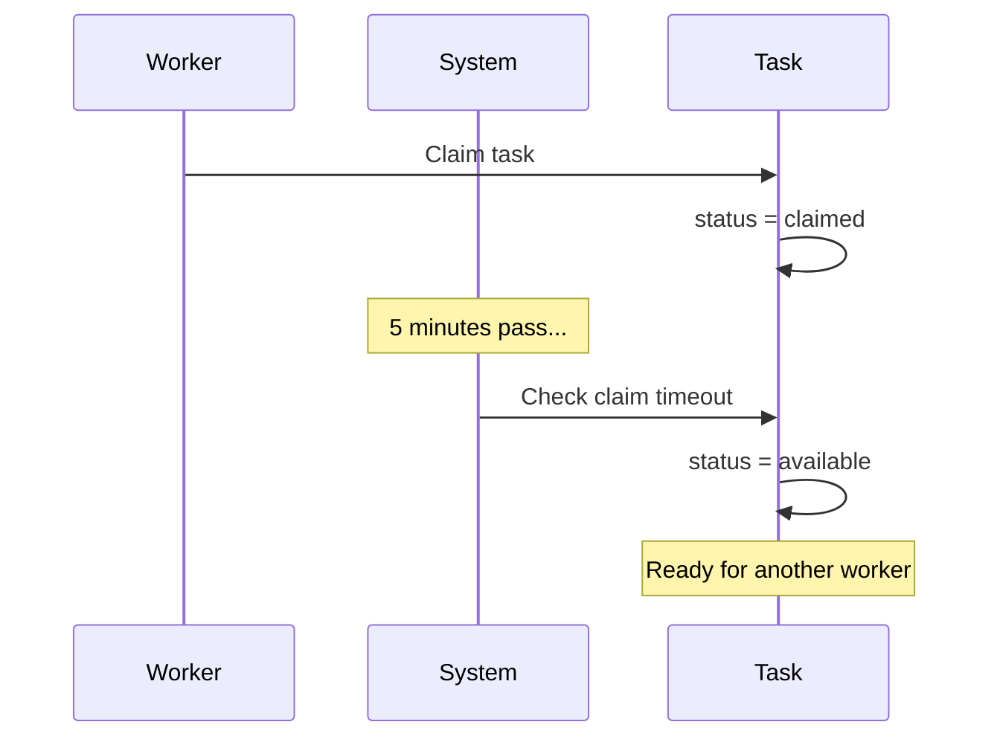
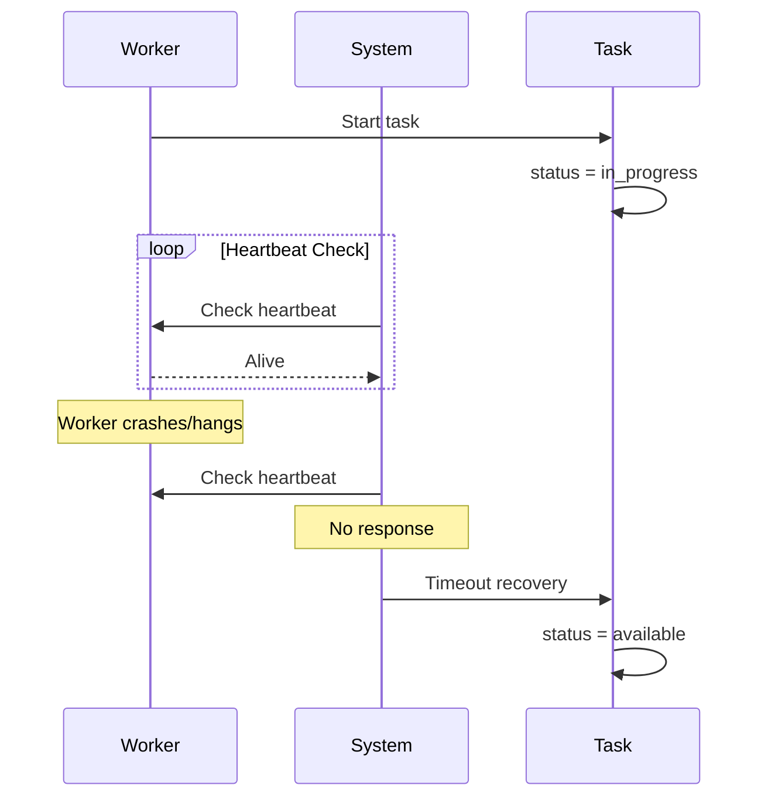
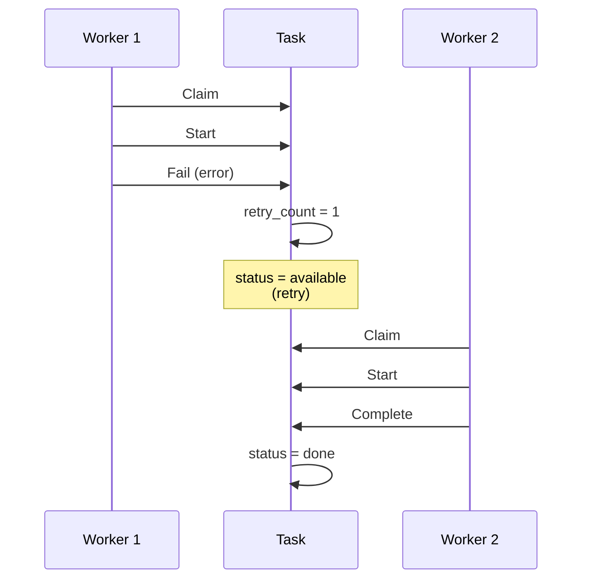

# Task Lifecycle

This document details the complete lifecycle of a task in the Claude Multi-Agent Coordination System.

---

## Task States

A task moves through the following states:

| State | Description | Who Sets |
|-------|-------------|----------|
| `available` | Ready to be claimed | Leader (on create) |
| `claimed` | Reserved by a worker | Worker (on claim) |
| `in_progress` | Actively being worked on | Worker (on start) |
| `done` | Successfully completed | Worker (on complete) |
| `failed` | Execution failed | Worker (on fail) |
| `cancelled` | Cancelled before completion | Leader |

---

## State Diagram



---

## State Transitions

### 1. Creation (available)

When a leader creates a task:

```python
# Option A
python coordination.py leader add-task "Create User model" -p 1

# Option B (MCP)
create_task(description="Create User model", priority=1)

# Option C
orch.add_task("Create User model", priority=1)
```

Task JSON:
```json
{
  "id": "task-20240115-a1b2",
  "description": "Create User model",
  "status": "available",
  "priority": 1,
  "dependencies": [],
  "created_at": "2024-01-15T10:30:00.000Z"
}
```

### 2. Claiming (claimed)

When a worker claims a task:

```python
# Option A
python coordination.py worker claim terminal-2

# Option B (MCP)
claim_task(agent_id="terminal-2")

# Option C (automatic)
task = await orch.claim_task("agent-1")
```

Task JSON after claiming:
```json
{
  "id": "task-20240115-a1b2",
  "description": "Create User model",
  "status": "claimed",
  "priority": 1,
  "claimed_by": "terminal-2",
  "claimed_at": "2024-01-15T10:31:00.000Z"
}
```

**Claim Rules:**
- Only `available` tasks can be claimed
- Tasks with unsatisfied dependencies cannot be claimed
- Atomic operation prevents race conditions

### 3. Starting (in_progress)

When a worker begins execution:

```python
# Option A
python coordination.py worker start terminal-2 task-xxx

# Option B (MCP)
start_task(agent_id="terminal-2", task_id="task-xxx")

# Option C (automatic)
# Orchestrator manages this internally
```

Task JSON:
```json
{
  "id": "task-20240115-a1b2",
  "status": "in_progress",
  "claimed_by": "terminal-2",
  "claimed_at": "2024-01-15T10:31:00.000Z",
  "started_at": "2024-01-15T10:31:05.000Z"
}
```

### 4. Completion (done)

When a worker successfully completes a task:

```python
# Option A
python coordination.py worker complete terminal-2 task-xxx "Created User model" \
  -c src/models/user.ts

# Option B (MCP)
complete_task(
  agent_id="terminal-2",
  task_id="task-xxx",
  output="Created User model with validation",
  files_created=["src/models/user.ts"]
)

# Option C
await orch.complete_task("task-xxx", TaskResult(
  output="Created User model",
  files_created=["src/models/user.ts"]
))
```

Task JSON:
```json
{
  "id": "task-20240115-a1b2",
  "status": "done",
  "claimed_by": "terminal-2",
  "completed_at": "2024-01-15T10:45:00.000Z",
  "result": {
    "output": "Created User model with validation",
    "files_created": ["src/models/user.ts"],
    "files_modified": []
  }
}
```

### 5. Failure (failed)

When a task fails:

```python
# Option A
python coordination.py worker fail terminal-2 task-xxx "Missing dependency: bcrypt"

# Option B (MCP)
fail_task(
  agent_id="terminal-2",
  task_id="task-xxx",
  error="Missing dependency: bcrypt"
)

# Option C
await orch.fail_task("task-xxx", "Missing dependency: bcrypt")
```

Task JSON:
```json
{
  "id": "task-20240115-a1b2",
  "status": "failed",
  "claimed_by": "terminal-2",
  "completed_at": "2024-01-15T10:40:00.000Z",
  "result": {
    "error": "Missing dependency: bcrypt"
  },
  "retry_count": 1,
  "max_retries": 3
}
```

---

## Dependency Management

Tasks can depend on other tasks. A task is only claimable when all dependencies are complete.

### Dependency Graph Example



**Legend:**
- Green: Completed (done)
- Orange: In Progress
- White: Blocked (dependencies not met)

### Creating Dependencies

```python
# Option A
python coordination.py leader add-task "Create endpoints" -p 2 -d task-001 task-002

# Option B (MCP)
create_task(
  description="Create endpoints",
  priority=2,
  dependencies=["task-001", "task-002"]
)

# Option C
t1 = orch.add_task("Setup", priority=1)
t2 = orch.add_task("Schema", priority=1)
t3 = orch.add_task("Endpoints", priority=2, dependencies=[t1.id, t2.id])
```

### Dependency Resolution

When claiming, the system checks:

1. Task status is `available`
2. All dependencies have status `done`
3. No other worker is claiming simultaneously (atomic check)

```python
def can_claim(task, all_tasks):
    if task.status != "available":
        return False

    for dep_id in task.dependencies:
        dep_task = find_task(dep_id, all_tasks)
        if dep_task.status != "done":
            return False

    return True
```

---

## Timeout and Recovery

### Claim Timeout

If a worker claims but doesn't start within the timeout:



### Execution Timeout

If a worker becomes unresponsive:



### Retry Logic

Failed tasks can be retried:



Configuration:
```json
{
  "max_retries": 3,
  "retry_delay": 30,
  "retry_backoff": "exponential"
}
```

---

## Task Priority

Tasks are processed by priority (lower number = higher priority):

| Priority | Description | Example |
|----------|-------------|---------|
| 1 | Critical path | Database setup |
| 2 | Core features | API endpoints |
| 3 | Secondary features | Validation |
| 4 | Non-essential | Documentation |
| 5 | Default | General tasks |

### Priority Queue

Workers claim the highest priority available task:

```
Queue (sorted by priority):
  [1] task-003: Create schema (available)
  [1] task-004: Create model (available)
  [2] task-005: Create endpoint (blocked - depends on task-003, task-004)
  [3] task-006: Write tests (blocked)
```

### Priority Boosting

Tasks waiting too long get priority boost:

```python
def get_effective_priority(task):
    base = task.priority
    wait_time = now() - task.created_at

    if wait_time > 5 minutes:
        boost = min(wait_time.minutes // 5, 2)  # Max boost of 2
        return max(1, base - boost)

    return base
```

---

## Metrics and Monitoring

### Task Metrics

```json
{
  "queue_size": 15,
  "by_status": {
    "available": 5,
    "claimed": 2,
    "in_progress": 3,
    "done": 4,
    "failed": 1
  },
  "throughput": {
    "tasks_per_minute": 2.5,
    "avg_completion_time_seconds": 180
  },
  "agents": {
    "active": 3,
    "idle": 1
  }
}
```

### Prometheus Metrics

```
# Task queue size by status
task_queue_size{status="available"} 5
task_queue_size{status="in_progress"} 3
task_queue_size{status="done"} 10

# Task completion rate
task_completions_total 15
task_failures_total 2

# Task duration histogram
task_duration_seconds_bucket{le="60"} 3
task_duration_seconds_bucket{le="300"} 8
task_duration_seconds_bucket{le="600"} 10
```

---

## Best Practices

### Task Design

1. **Atomic**: Each task should be completable independently
2. **Bounded**: 5-15 minutes of work per task
3. **Specific**: Clear description of what needs to be done
4. **Contextual**: Include relevant file paths and hints

### Dependency Design

1. **Minimize chains**: Long dependency chains create bottlenecks
2. **Parallelize**: Independent tasks should not have false dependencies
3. **Clear ordering**: Dependencies should be logically necessary

### Error Handling

1. **Descriptive errors**: Include actionable information
2. **Retry appropriately**: Transient failures should retry
3. **Fail fast**: Don't retry permanent failures

---

## See Also

- [System Overview](overview.md)
- [Component Diagram](components.md)
- [ADR-005: Task Lifecycle](../adr/ADR-005-task-lifecycle.md)
